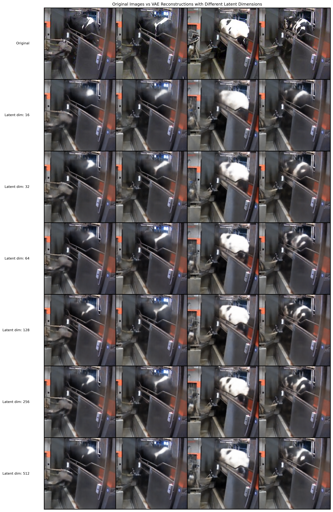
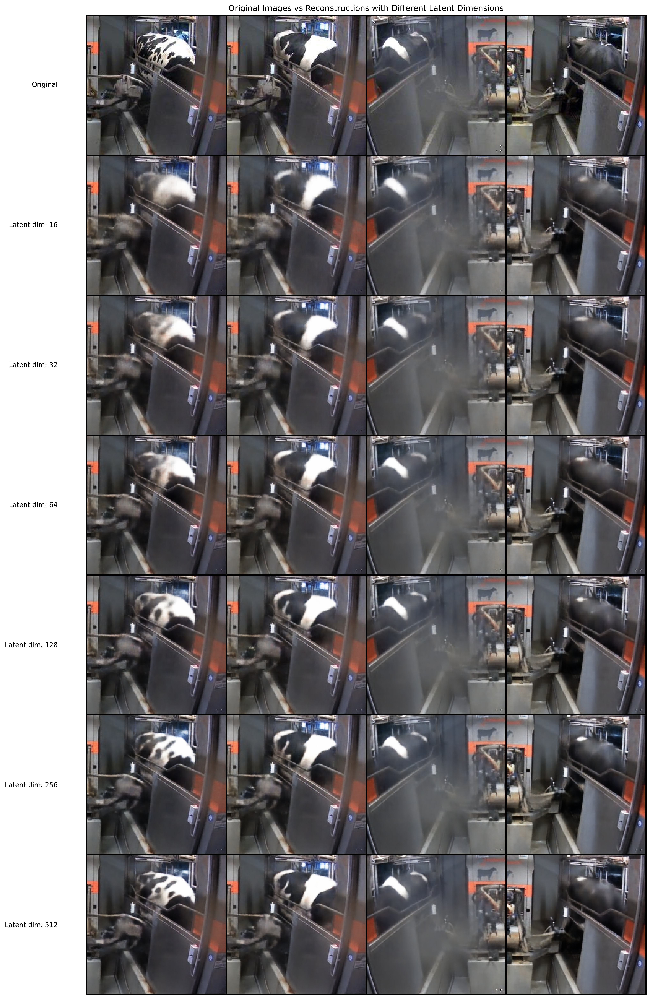

# Image Autoencoder Project

This project implements and trains autoencoders and variational autoencoders (VAEs) on image datasets, specifically Imagenette v2 and a custom cow image dataset.

## Project Structure

- `autoencoder_imagenette_v2.py`: Implements and trains an autoencoder on the Imagenette v2 dataset.
- `vae_cow.py`: Implements and trains a variational autoencoder on a custom cow image dataset.
- `autoencoder_cow.py`: Implements and trains an autoencoder on a custom cow image dataset (Note: This script has memory issues and needs optimization).

## Features

- Downloads and preprocesses the Imagenette v2 dataset
- Implements custom datasets for SQLite-based image storage
- Trains autoencoders and VAEs with various latent space dimensions
- Uses early stopping to prevent overfitting
- Logs training progress and results using Weights & Biases (wandb)
- Visualizes original and reconstructed images

## Results

Here are some example results from our trained models:

### Variational Autoencoder on Cow Dataset

These images demonstrate the performance of our VAE on the custom cow dataset. The top row shows original cow images, while the bottom row displays the corresponding reconstructions. Note how the VAE captures the overall structure and coloration of the cows, though some fine details may be slightly blurred.

### Autoencoder on Cow Dataset

This image compares original cow images (top row) with reconstructions from our standard autoencoder (bottom row). The autoencoder shows good performance in reconstructing the general features of the cows, including their poses and environments.

These results demonstrate the effectiveness of our models in learning compact representations of the input images and reconstructing them with reasonable fidelity. The reconstructions, while not perfect, capture the essential characteristics of the original images, showing that our autoencoders and VAEs have successfully learned to encode and decode the key features of the datasets.
